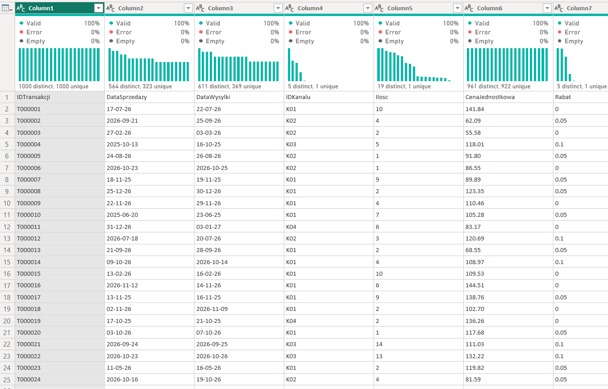
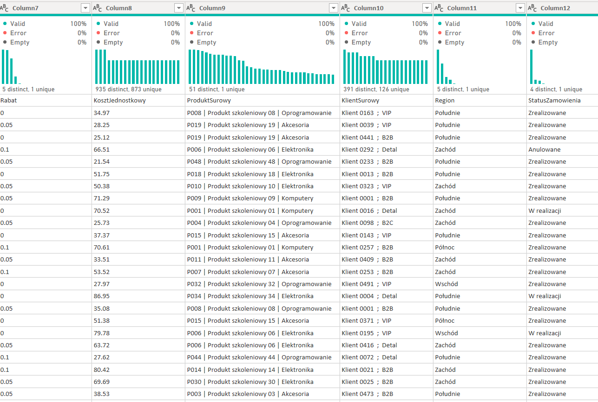
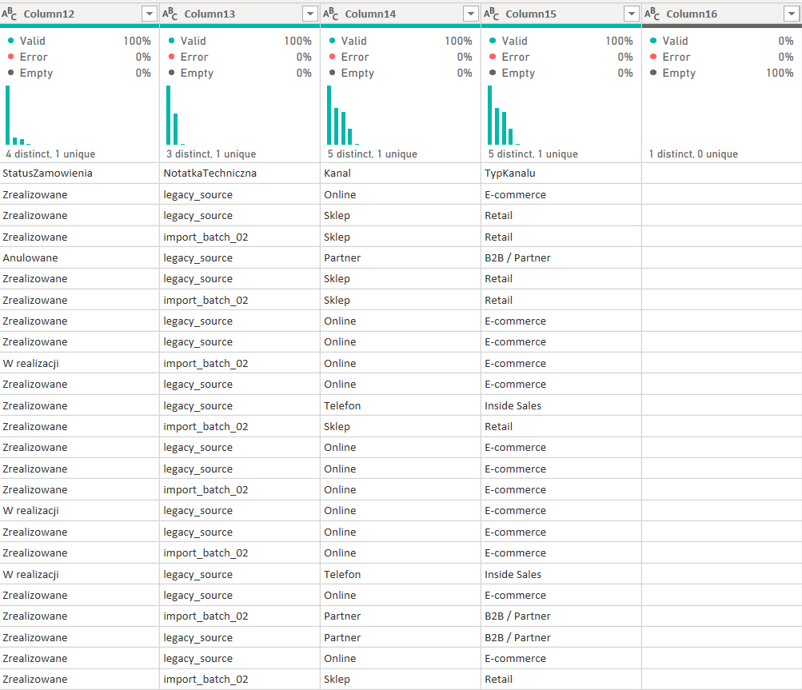
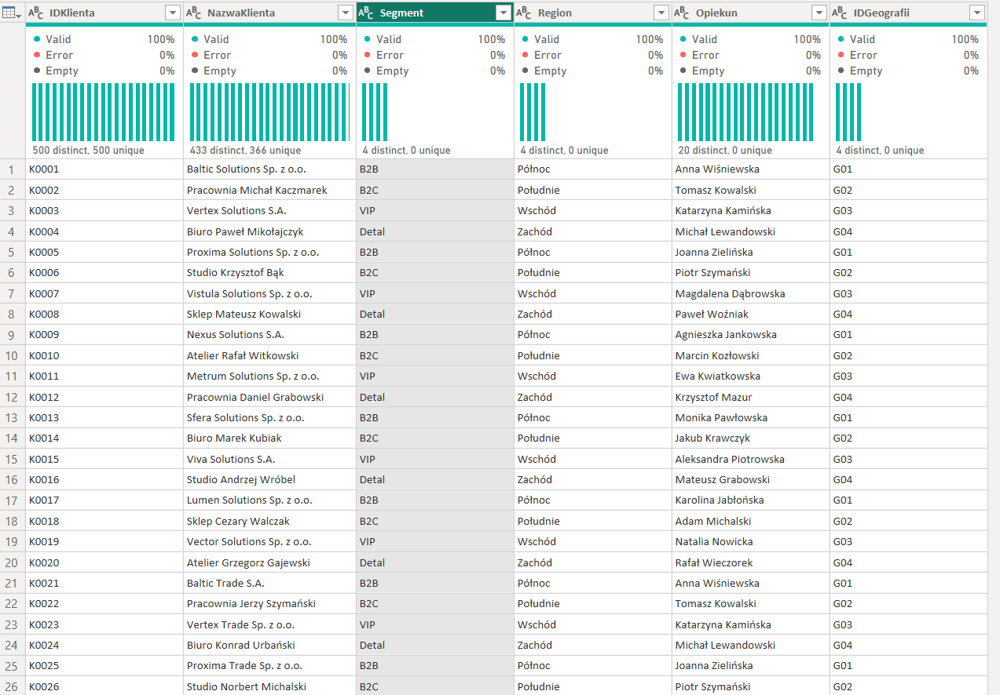
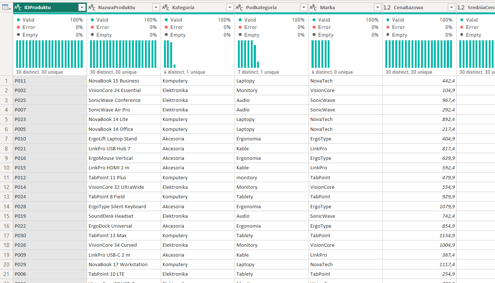
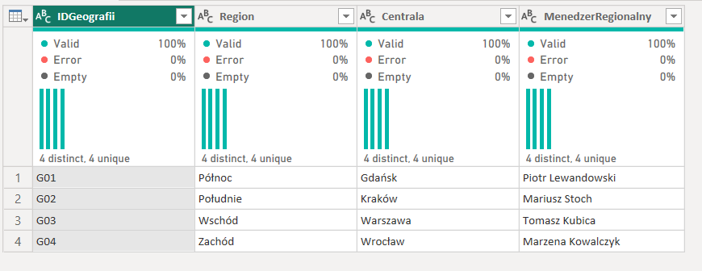
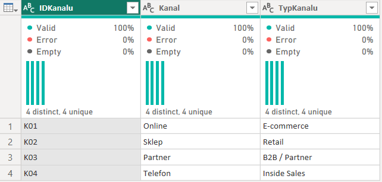
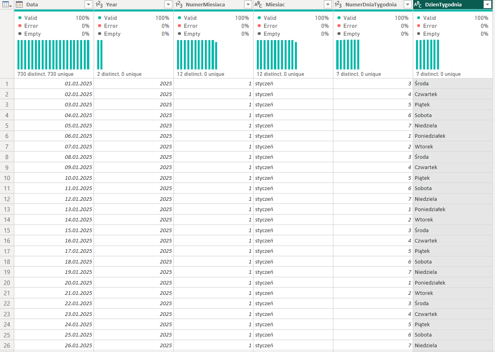
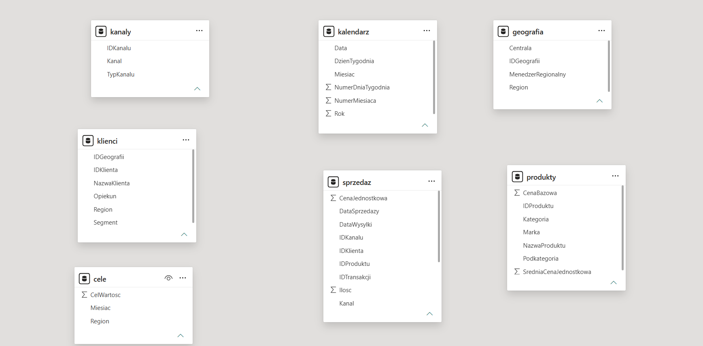
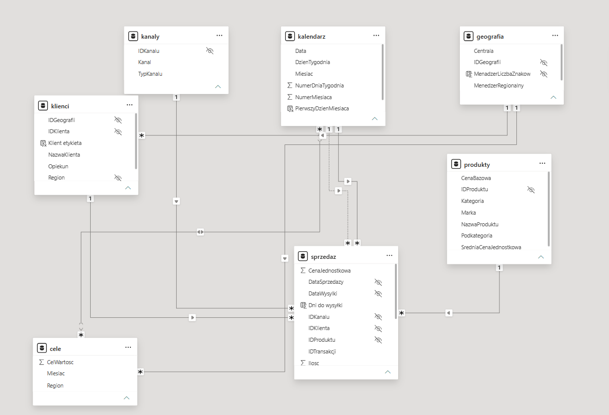

# PowerBI-project

Narzędzia: Microsoft Power BI, Power Query, DAX

## Opis projektu 
Projekt przedstawia analizę symulowanych danych sprzedażowych fikcyjnej firmy działającej na polskim rynku. Zbiór obejmuje ponad 16 tys. rekordów w 7 powiązanych tabelach, zawierających dane dotyczące sprzedaży, klientów, produktów, kanałów sprzedaży, geografii, kalendarza oraz miesięcznych celów sprzedażowych.

Główna tabela transakcyjna zawiera 15 000 rekordów sprzedaży, natomiast pozostałe tabele pełnią funkcję tabel wymiarów oraz danych pomocniczych. Dane obejmują okres od stycznia 2025 do grudnia 2026, czyli 24 miesiące historii sprzedaży.

## Struktura danych 
Model składa się z 7 tabel:
| Tabela                 | Liczba rekordów | Zawartość                                                                                                                  |
| ---------------------- | --------------: | -------------------------------------------------------------------------------------------------------------------------- |
| **sprzedaz_surowa_v2** |          15 000 | dane transakcyjne: data sprzedaży i wysyłki, produkt, klient, region, kanał, ilość, cena, rabat, koszt i status zamówienia |
| **klienci**            |             500 | dane klientów: nazwa, segment, region, opiekun i przypisanie geograficzne                                                  |
| **produkty**           |              30 | katalog produktów: nazwa, kategoria, podkategoria, marka i cena bazowa                                                     |
| **kanaly**             |               4 | kanały sprzedaży wraz z ich typem                                                                                          |
| **geografia**          |               4 | regiony, centrale oraz menedżerowie regionalni                                                                             |
| **kalendarz**          |             737 | tabela dat obejmująca lata 2025–2026                                                                                       |
| **cele_miesieczne**    |              96 | miesięczne cele sprzedażowe dla czterech regionów                                                                          |

## Przygotowanie i czyszczenie danych
Dane zostały celowo przygotowane w sposób przypominający informacje pochodzące z różnych systemów biznesowych, dlatego przed rozpoczęciem analizy wymagają transformacji i uporządkowania.

Proces ETL został wykonany w Power Query. Narzędzie zostało wykorzystane do importu, transformacji oraz przygotowania danych do dalszego modelowania i analizy.
Proces czyszczenia danych rozpoczęto od tabeli sprzedaż 





W ramach przygotowania danych:
- ustawiono prawidłowe nagłówki i typy danych, w tym właściwe ustawienia regionalne dla dat
- usunięto błędne wartości w kolumnach z datami,
- z nieuporządkowanych pól klientów i produktów wydobyto właściwe identyfikatory,
- ustandaryzowano identyfikatory klientów poprzez dodanie odpowiedniego prefiksu,
- usunięto zbędne spacje oraz niepotrzebne znaki,
- oczyszczono i ujednolicono nazwy regionów,
- ustandaryzowano wartości statusów zamówień do postaci Done, In progress oraz Cancelled,
- brakujące wartości rabatu zastąpiono zerami,
- usunięto zbędne kolumny techniczne,
zidentyfikowano i usunięto duplikaty transakcji.


Dodatkowo przygotowano i uporządkowano osobne tabele klientów, produktów, geografii oraz kanałów sprzedaży. Na podstawie danych sprzedażowych utworzono również słownik kanałów, a tabela produktów została wzbogacona o informacje o cenach oraz średniej cenie produktu wyliczonej z wykorzystaniem grupowania.

Tabela klienci


Tabela produkty


Tabela geografia


Tabela kanały



Dynamiczna tabela kalendarza

Jednym z elementów transformacji było przygotowanie dedykowanej tabeli kalendarza. Zakres tabeli został wyznaczony automatycznie na podstawie minimalnej i maksymalnej daty sprzedaży, dzięki czemu kalendarz dostosowuje się do zakresu danych źródłowych.

Tabela została wzbogacona m.in. o rok, numer i nazwę miesiąca, numer dnia tygodnia oraz nazwę dnia tygodnia. Nazwy miesięcy i dni zostały odpowiednio sformatowane, a kolumnom tekstowym przypisano właściwy porządek sortowania.



## Model danych

Po zakończeniu transformacji przygotowano relacyjny model danych oparty na rozdzieleniu tabeli faktów od tabel wymiarów. Tabela sprzedaży pełni rolę centralnej tabeli faktów, natomiast dane opisujące klientów, produkty, kanały, geografię oraz czas służą jako wymiary pozwalające filtrować i grupować wyniki. Takie podejście odpowiada zalecanemu w Power BI modelowi gwiazdy.



Relacje zostały utworzone ręcznie, z uwzględnieniem prawidłowej kardynalności oraz kierunku filtrowania. Dla tabeli sprzedaży i kalendarza przygotowano dwie relacje: aktywną dla daty sprzedaży oraz nieaktywną dla daty wysyłki. Ukryto również techniczne kolumny kluczy oraz uporządkowano strukturę modelu w celu zwiększenia jego czytelności.

W dalszym etapie do modelu została dołączona także tabela miesięcznych celów sprzedażowych poprzez powiązanie jej z tabelami kalendarza i geografii.



## Analiza danych za pomocą DAX

Po przygotowaniu modelu utworzono dedykowaną tabelę _Measures, w której zgromadzono miary wykorzystywane w raporcie. Dzięki temu logika biznesowa została oddzielona od danych źródłowych i uporządkowana w jednym miejscu.

Analiza rozpoczęła się od podstawowych miar agregujących, takich jak:

suma sprzedanej ilości, 
```dax
Suma Ilości = 
SUM(sprzedaz[Ilosc])
```
średnia cena, 
```dax
Średnia cena = 
 AVERAGE(sprzedaz[CenaJednostkowa])
```
cena minimalna 
```dax
Najniższa cena = 
MIN(sprzedaz[CenaJednostkowa])
```
i 
maksymalna 
```dax
Najwyższa cena = 
MAX(sprzedaz[CenaJednostkowa])
```
oraz liczba transakcji.
```dax
Liczba Transakcji = 
COUNTROWS(sprzedaz)
```

Następnie przygotowano bardziej rozbudowane kalkulacje biznesowe obejmujące:

sprzedaż brutto,
 ```dax
Liczba Transakcji = 
COUNTROWS(sprzedaz)
```
sprzedaż netto, 
```dax
Liczba Transakcji = 
COUNTROWS(sprzedaz)
```
średnią wartość transakcji, 
```dax
Liczba Transakcji = 
COUNTROWS(sprzedaz)
```
koszt sprzedaży, 
```dax
Liczba Transakcji = 
COUNTROWS(sprzedaz)
```
marżę brutto, 
```dax
Liczba Transakcji = 
COUNTROWS(sprzedaz)
```
marżę procentową, 
```dax
Liczba Transakcji = 
COUNTROWS(sprzedaz)
```
liczbę klientów, 
```dax
Liczba Transakcji = 
COUNTROWS(sprzedaz)
```
liczbę różnych produktów 
```dax
Liczba Transakcji = 
COUNTROWS(sprzedaz)
```
oraz średni czas od sprzedaży do wysyłki.

```dax
Liczba Transakcji = 
COUNTROWS(sprzedaz)
```

W kalkulacjach wykorzystano również funkcje iterujące DAX, co pozwoliło obliczać wartości wynikające z operacji wykonywanych na poszczególnych wierszach tabeli sprzedaży, np. przy wyznaczaniu wartości sprzedaży czy kosztu.

Analiza marży

Na podstawie wyliczonej marży procentowej przygotowano również klasyfikację wyników. Transakcje lub wyniki mogły zostać przypisane do kategorii:

wysoka marża — ≥ 50%, średnia marża — ≥ 46%, niska marża — pozostałe przypadki.

Pozwoliło to przejść od prostego raportowania wartości sprzedaży do oceny jakości i rentowności generowanego przychodu.

Analiza kontekstu filtrowania

Istotnym elementem projektu była praca z kontekstem filtra i kontekstem wiersza, czyli jednym z najważniejszych mechanizmów języka DAX. Wyniki miar dynamicznie reagują na filtry, slicery, relacje oraz wybory użytkownika na wizualizacjach.

Do bardziej zaawansowanych analiz zastosowano m.in. funkcję CALCULATE, pozwalającą modyfikować kontekst filtrowania obliczenia.

Pozwoliło to przygotować m.in.:

sprzedaż brutto dla kanału Online, udział poszczególnych kanałów w całkowitej sprzedaży, relację całkowitej sprzedaży do sprzedaży Online, sprzedaż produktów z wybranych kategorii oraz procentowy udział segmentów klientów w całkowitym wyniku.

W bardziej złożonych formułach wykorzystano również zmienne VAR/RETURN oraz odwołania do wcześniej zdefiniowanych miar, dzięki czemu kod DAX jest bardziej czytelny i możliwy do ponownego wykorzystania.

Kolumny i tabele kalkulowane

Oprócz miar utworzono również elementy kalkulowane w DAX. W tabeli sprzedaży wyliczono liczbę dni pomiędzy sprzedażą a wysyłką, w kalendarzu utworzono pierwszy dzień miesiąca, a w danych klientów przygotowano dodatkową etykietę klienta na podstawie nazwy przedsiębiorstwa.

W ramach ćwiczeń utworzono także tabelę kalendarza za pomocą DAX, wykorzystując zmienne do podziału logiki obliczenia na poszczególne etapy.

Istotnym elementem projektu było również rozróżnienie zastosowania miar i kolumn kalkulowanych — miary wykorzystywane są przede wszystkim do dynamicznych obliczeń zależnych od kontekstu raportu, natomiast kolumny kalkulowane do wartości wymaganych na poziomie pojedynczego wiersza.

Cel biznesowy projektu

Końcowym celem projektu jest stworzenie interaktywnego raportu umożliwiającego użytkownikowi analizę:

sprzedaży i liczby transakcji, rentowności i marży, struktury sprzedaży według kanałów, udziału segmentów klientów, wyników produktów i kategorii, wyników regionalnych, czasu realizacji zamówień oraz realizacji założonych celów sprzedażowych.

Dzięki zastosowaniu Power Query, relacyjnego modelu danych oraz DAX raport nie ogranicza się do prezentowania statycznych wartości. Wyniki kalkulacji zmieniają się dynamicznie wraz z kontekstem wybranym przez użytkownika, co umożliwia analizę danych na różnych poziomach szczegółowości.


