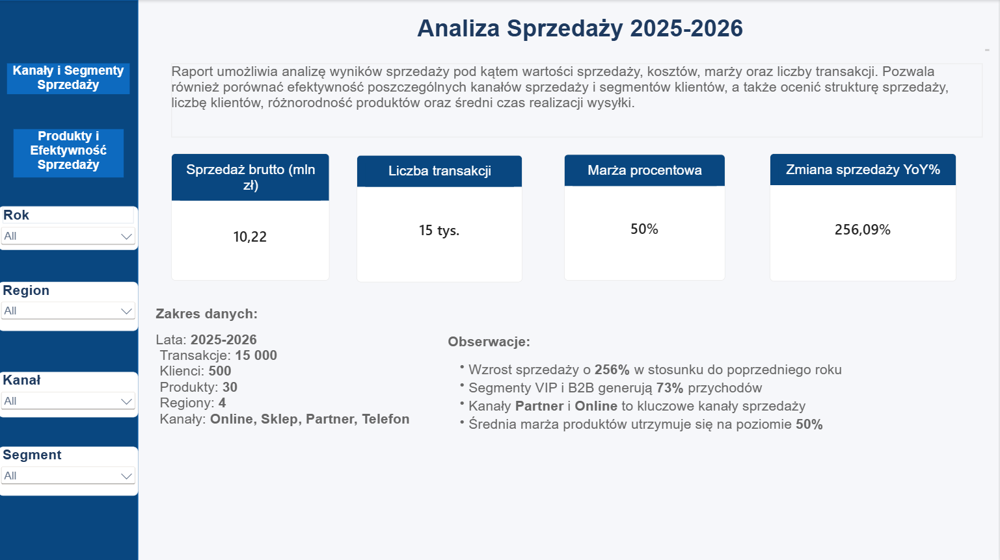
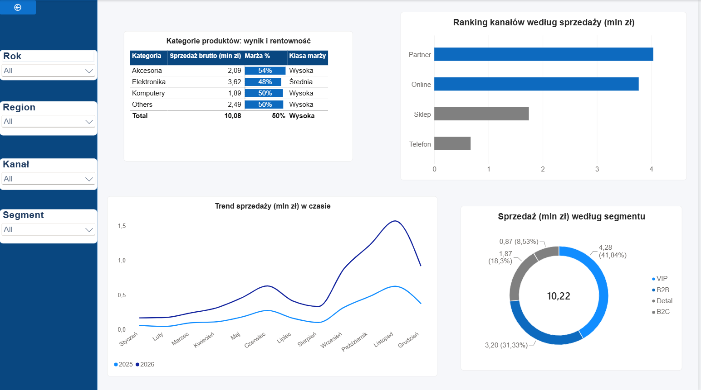
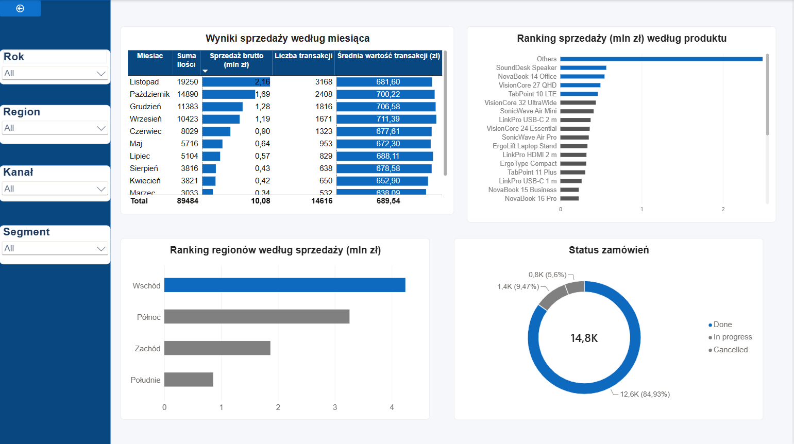

# Sales-Performance-Analysis

Narzędzia: Microsoft Power BI, Power Query, DAX

## Opis projektu 
Projekt przedstawia analizę symulowanych danych sprzedażowych fikcyjnej firmy działającej na polskim rynku. Zbiór obejmuje ponad **16 tys**. rekordów w **6** powiązanych tabelach, zawierających dane dotyczące sprzedaży, klientów, produktów, kanałów sprzedaży, geografii, kalendarza oraz miesięcznych celów sprzedażowych.

Główna tabela transakcyjna zawiera **15 000** rekordów sprzedaży, natomiast pozostałe tabele pełnią funkcję tabel wymiarów oraz danych pomocniczych. Dane obejmują okres od stycznia 2025 do grudnia 2026. 

## Cel biznesowy
Głównym celem projektu było stworzenie interaktywnego raportu umożliwiającego analizę:

- monitorowanie wyników sprzedaży w latach **2025–2026**,
- ocena rentowności i marży,
- analiza udziału kanałów sprzedaży i segmentów klientów,
- identyfikacja najlepszych i najsłabszych produktów,
- porównanie wyników regionalnych,
- sprawdzanie trendu sprzedaży w czasie oraz realizacji celów.

## Struktura danych 
Model składa się z 7 tabel:
| Tabela                 | Liczba rekordów | Zawartość                                                                                                                  |
| ---------------------- | --------------: | -------------------------------------------------------------------------------------------------------------------------- |
| **sprzedaz** |          15 000 | dane transakcyjne: data sprzedaży i wysyłki, produkt, klient, region, kanał, ilość, cena, rabat, koszt i status zamówienia |
| **klienci**            |             500 | dane klientów: nazwa, segment, region, opiekun i przypisanie geograficzne                                                  |
| **produkty**           |              30 | katalog produktów: nazwa, kategoria, podkategoria, marka i cena bazowa                                                     |
| **kanaly**             |               4 | kanały sprzedaży wraz z ich typem                                                                                          |
| **geografia**          |               4 | regiony, centrale oraz menedżerowie regionalni                                                                             |
| **kalendarz**          |             737 | tabela dat obejmująca lata 2025–2026                                                                                       |

## Przygotowanie i czyszczenie danych
Dane zostały celowo przygotowane w sposób przypominający informacje pochodzące z różnych systemów biznesowych, dlatego przed rozpoczęciem analizy wymagają transformacji i uporządkowania.

Proces ETL został wykonany w Power Query. Narzędzie zostało wykorzystane do importu, transformacji oraz przygotowania danych do dalszego modelowania i analizy.
Proces czyszczenia danych rozpoczęto od tabeli sprzedaż 

W ramach przygotowania danych:
- ustawiono prawidłowe nagłówki i typy danych, w tym właściwe ustawienia regionalne dla dat
- usunięto błędne wartości w kolumnach z datami,
- z nieuporządkowanych pól klientów i produktów wydobyto właściwe identyfikatory,
- ustandaryzowano identyfikatory klientów poprzez dodanie odpowiedniego prefiksu,
- usunięto zbędne spacje oraz niepotrzebne znaki,
- oczyszczono i ujednolicono nazwy regionów,
- ustandaryzowano wartości statusów zamówień do postaci Done, In progress oraz Cancelled,
- brakujące wartości rabatu zastąpiono zerami,
- usunięto zbędne kolumny techniczne,
zidentyfikowano i usunięto duplikaty transakcji.

Dodatkowo przygotowano i uporządkowano osobne tabele klientów, produktów, geografii oraz kanałów sprzedaży. Na podstawie danych sprzedażowych utworzono również słownik kanałów, a tabela produktów została wzbogacona o informacje o cenach oraz średniej cenie produktu wyliczonej z wykorzystaniem grupowania.

**Tabela klienci**

**Tabela produkty**

**Tabela geografia**

**Tabela kanały**

Jednym z elementów transformacji było przygotowanie dedykowanej tabeli kalendarza. Zakres tabeli został wyznaczony automatycznie na podstawie minimalnej i maksymalnej daty sprzedaży, dzięki czemu kalendarz dostosowuje się do zakresu danych źródłowych.

Tabela została wzbogacona m.in. o rok, numer i nazwę miesiąca, numer dnia tygodnia oraz nazwę dnia tygodnia. Nazwy miesięcy i dni zostały odpowiednio sformatowane, a kolumnom tekstowym przypisano właściwy porządek sortowania.

Kod transformacji danych w języku M znajduje się w folderze **ETL**.

## Model danych

Po zakończeniu transformacji przygotowano relacyjny model danych oparty na rozdzieleniu tabeli faktów od tabel wymiarów. Tabela sprzedaży pełni rolę centralnej tabeli faktów, natomiast dane opisujące klientów, produkty, kanały, geografię oraz czas służą jako wymiary pozwalające filtrować i grupować wyniki.

Relacje zostały utworzone ręcznie, z uwzględnieniem prawidłowej kardynalności oraz kierunku filtrowania. Dla tabeli sprzedaży i kalendarza przygotowano dwie relacje: aktywną dla daty sprzedaży oraz nieaktywną dla daty wysyłki. Ukryto również techniczne kolumny kluczy oraz uporządkowano strukturę modelu w celu zwiększenia jego czytelności.

W dalszym etapie do modelu została dołączona także tabela miesięcznych celów sprzedażowych poprzez powiązanie jej z tabelami kalendarza i geografii.

## Analiza danych za pomocą DAX

W ramach projektu zbudowano zestaw miar DAX, które pozwalają na obliczanie między innymi:

- sumy ilości sprzedanych produktów,
- sprzedaży brutto i netto,
- średniej ceny i średniej wartości transakcji,
- kosztu sprzedaży,
- marży brutto i marży procentowej,
- liczby klientów i różnych produktów,
- udziału kanałów i segmentów klientów,
- średniego czasu od sprzedaży do wysyłki.

Pełny słownik miar w języku DAX znajduje się w pliku **measures_DAX.txt**

## Wyniki 
Raport prezentuje wyniki sprzedaży firmy w okresie od stycznia 2025 do grudnia 2026. Kluczowe wskaźniki obejmują sprzedaż brutto, liczbę transakcji, marżę procentową oraz dynamikę wzrostu sprzedaży w porównaniu z rokiem poprzednim. Na dashboardzie przedstawiono kluczowe wskaźniki biznesowe:

- Sprzedaż brutto — całkowita wartość sprzedaży w analizowanym okresie,
- Liczba transakcji — całkowity wolumen operacji sprzedażowych,
- Marża brutto i marża procentowa — ocena rentowności sprzedaży,
- Średnia wartość transakcji — wartość przeciętnego zamówienia,
- Koszt sprzedaży — nakłady związane z realizacją sprzedaży,
- Liczba klientów i liczba różnych produktów — zasięg i struktura oferty,
- Udział kanałów sprzedaży — udział poszczególnych kanałów w przychodach,
- Udział segmentów klientów — udział klienta w całkowitej sprzedaży,
- Dynamika YoY % — zmiana sprzedaży względem poprzedniego roku.
  

## Wnioski 
Najważniejsze wnioski wynikające z analizy są następujące:

- Dynamiczny wzrost sprzedaży. Wzrost o **156%** w stosunku do poprzedniego roku. Wysoki wzrost sprzedaży wynika z tego, że w roku 2025 sprzedaż wynosiła **2,87 mln zł** a w roku 2026 **7,35 mln zł**. Poziom sprzedaży do roku poprzedniego wynosi **256%**.
- Średnia wartość transakcji jest w graniach — około **650–710 zł** — podczas gdy sprzedaż miesięczna silnie się zmienia. Wzrost jest więc napędzany przede wszystkim większą liczbą transakcji. Najwyższą średnią wartość transakcji osiąga wrzesień. Wynosi ona **711,39 zł**. Najniższy wynik ma marzec — **638,09 zł**.
- Marża procentowa utrzymuje się na poziomie **50%**,
- Widoczna jest silna sezonowość. Łącznie za 2025-2026 najlepszym miesiącem jest listopad: **2,16 mln zł** i **3 168** transakcji. Październik osiąga **1,69 mln zł**, a grudzień **1,28 mln zł**. Szczyt popytu przypada zatem na IV kwartał. 
- Sprzedaż jest silnie skoncentrowana w kanałach **Partner** i **Online**, które odpowiadają łącznie za **76,38%** sprzedaży brutto. Udział Sklepu wynosi **17,06%**, a Telefonu tylko **6,56%**.
- Najważniejszą rolę odgrywają segmenty klientów **B2B** i **VIP**. Segmenty te odpowiadają łącznie za **73,17%** przychodów:
- Sprzedaż jest silnie zróżnicowana regionalnie: Południe generuje **49,95%** sprzedaży brutto, Zachód **31,95%**, Wschód **11,12%**, a Północ **6,98%**. Dwa największe regiony odpowiadają łącznie za **81,90%** sprzedaży.
- Najlepiej sprzedającym się produktem jest **P013**, generujący **563,99 tys. zł**, natomiast pięć najlepszych produktów odpowiada łącznie za **24,40%** sprzedaży. Najsłabszy produkt, **P027**, osiąga **61,14 tys. zł**.
- Realizacja zamówień jest na wysokim poziomie: **84,93%** zamówień zostało zrealizowanych, **9,47%** jest w realizacji, a jedynie **5,60%** anulowano.

## Rekomendacje biznesowe
- Należy wzmocnić sprzedaż w regionach Wschód i Północ. Warto przeanalizować dostępność produktów, aktywność handlowców i skuteczność lokalnych kampanii.
- Zabezpieczyć regiony Południe i Zachód. Odpowiadają za **81,90%** sprzedaży, dlatego należy rozwijać programy lojalnościowe i utrzymywać odpowiednie zapasy.
- Skoncentrować inwestycje na kanałach **Partner** i **Online**.
Generują łącznie **76,38%** sprzedaży. Warto zwiększyć budżet marketingowy online i premiować najskuteczniejszych partnerów.
- Poprawić efektywność Sklepu i Telefonu. Łączny udział wynosi tylko **23,62%**. Należy ocenić rentowność tych kanałów, wdrożyć sprzedaż krzyżową. Wykorzystać sezonowość IV kwartału
- Zapasy, obsadę i kampanie należy zwiększać przed październikiem. Listopad generuje najwyższą sprzedaż łącznie za lata **2025–2026**.
- Rozwijać sprzedaż produktów o wysokiej marży
- Akcesoria osiągają najwyższą marżę — **54%**. Dobrym działaniem będzie oferowanie ich w pakietach z elektroniką i komputerami.
- Zmniejszyć udział anulowanych zamówień. Obecny poziom to **5,60%**. Należy przeanalizować anulowania według produktu, kanału i regionu. 

## Podsumowanie 
Analiza sprzedaży za lata 2025–2026 pozwoliła ocenić dynamikę przychodów, rentowność kategorii, znaczenie kanałów i segmentów klientów oraz skuteczność realizacji zamówień. Przed analizą dane zostały oczyszczone i ujednolicone w Power Query. Badanie objęło 14 811 transakcji, jednak dalszego uporządkowania wymagają produkty przypisane do grupy „Others”.

Najważniejsze wnioski z analizy wskazują, że:
- Sprzedaż znajduje się w fazie dynamicznego wzrostu. Sprzedaż brutto zwiększyła się z **2,87 mln zł** w 2025 roku do **7,35 mln zł** w 2026 roku, co oznacza wzrost o 156,09%. 
- Sprzedaż jest silnie skoncentrowana w kanałach Partner i Online. Kanał Partner odpowiada za **39,51%**, a Online za **36,88%** sprzedaży brutto. Łącznie generują one **76,38%** wyniku, podczas gdy udział Sklepu wynosi **17,06%**, a Telefonu **6,56%**. Dalsze inwestycje powinny koncentrować się na najbardziej efektywnych kanałach, przy jednoczesnej ocenie rentowności pozostałych.
- Segmenty VIP i B2B stanowią podstawę przychodów firmy. Generują łącznie **73,17%** sprzedaży, co uzasadnia rozwijanie indywidualnej obsługi, ofert lojalnościowych i działań retencyjnych. Tak wysoka koncentracja oznacza jednak również zależność od ograniczonej grupy klientów.
- Wyniki sprzedaży są silnie zróżnicowane regionalnie. Południe odpowiada za **49,95%**, a Zachód za **31,95%** sprzedaży brutto. Łącznie regiony te generują **81,90%** wyniku, podczas gdy udział Wschodu i Północy wynosi jedynie **18,10%**. Wymaga to zarówno ochrony pozycji w regionach kluczowych, jak i zbadania potencjału wzrostu na słabszych rynkach.
- Wysoka sprzedaż elektroniki nie przekłada się na najwyższą rentowność. Elektronika generuje największą wartość sprzedaży — **3,62 mln zł** — ale jej marża wynosi **48%**. Akcesoria osiągają natomiast najwyższą marżę, wynoszącą **54%**. Uzasadnia to rozwijanie sprzedaży pakietowej i cross-sellingu akcesoriów z elektroniką oraz komputerami.
- Sprzedaż wykazuje wyraźną sezonowość. W danych łącznie za lata 2025–2026 najlepszym miesiącem był listopad, osiągający **2,16 mln zł** i **3 168** transakcji. Wzrost popytu w IV kwartale wskazuje na potrzebę wcześniejszego przygotowania zapasów, obsady oraz kampanii marketingowych.
- Proces realizacji zamówień funkcjonuje na dobrym poziomie. Zrealizowano **84,93%** zamówień, **9,47%** pozostaje w realizacji, a **5,60%** anulowano. Warto przeanalizować anulowania według kanału, produktu i regionu oraz dążyć do obniżenia ich udziału poniżej **4%**.
- Jakość danych produktowych wymaga dalszej poprawy. Produkty P031–P050 zostały zagregowane jako „Others”, przez co grupa ta odpowiada za znaczną część sprzedaży i utrudnia identyfikację rzeczywistych liderów asortymentu. Przed podejmowaniem szczegółowych decyzji produktowych należy uzupełnić ich nazwy, marki i kategorie.
  
Podsumowując, firma osiąga dynamiczny wzrost przy wysokiej, około **50%** marży. Największy potencjał dalszego rozwoju stanowią kanały Partner i Online, segmenty VIP i B2B, rentowne akcesoria oraz odpowiednie wykorzystanie sezonu jesiennego. Kluczowymi wyzwaniami pozostają koncentracja sprzedaży, rozwój słabszych regionów, ograniczenie anulowań oraz poprawa jakości danych produktowych.